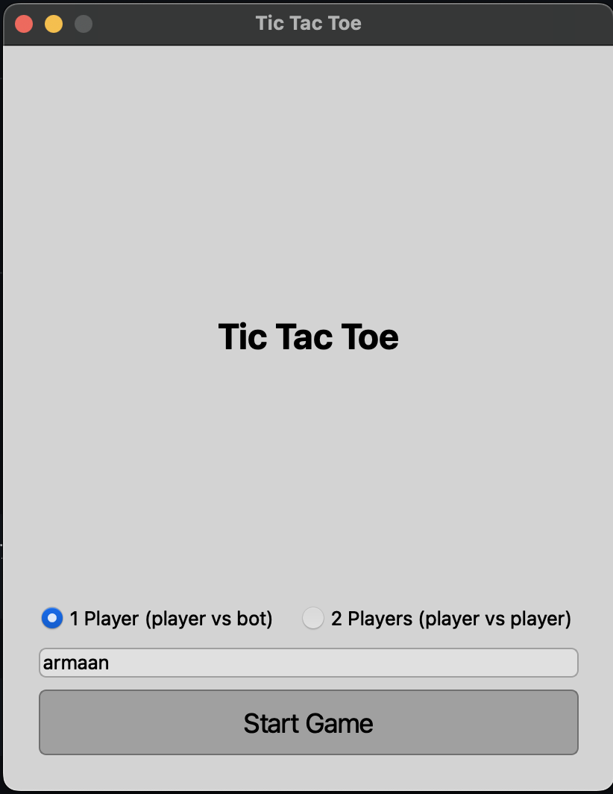
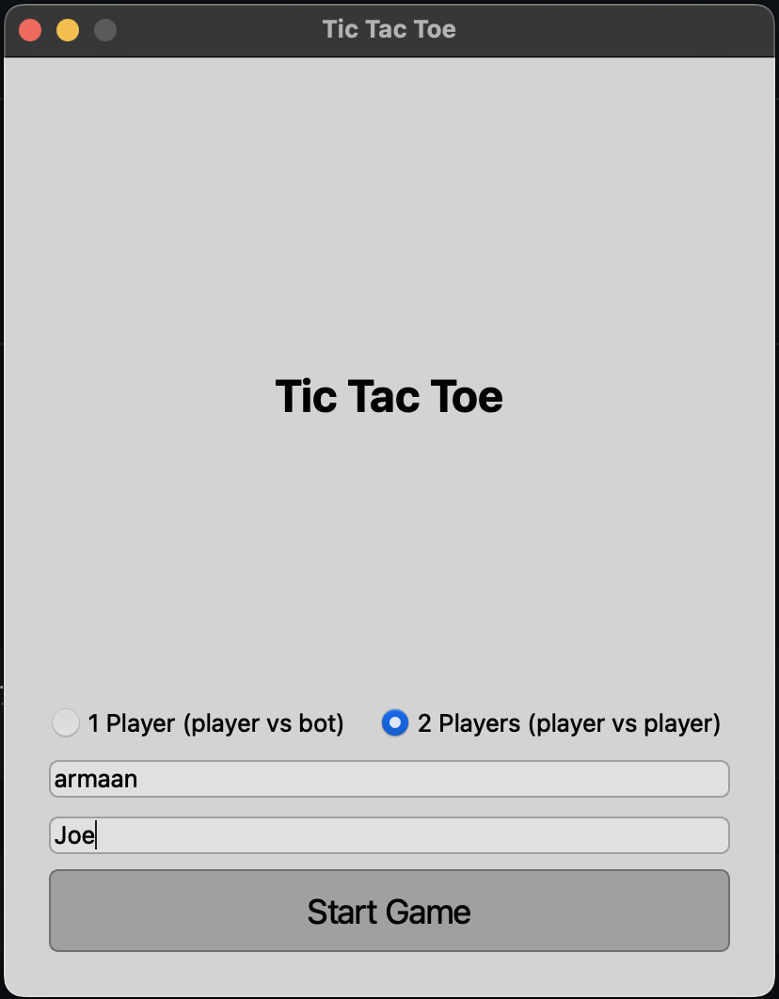
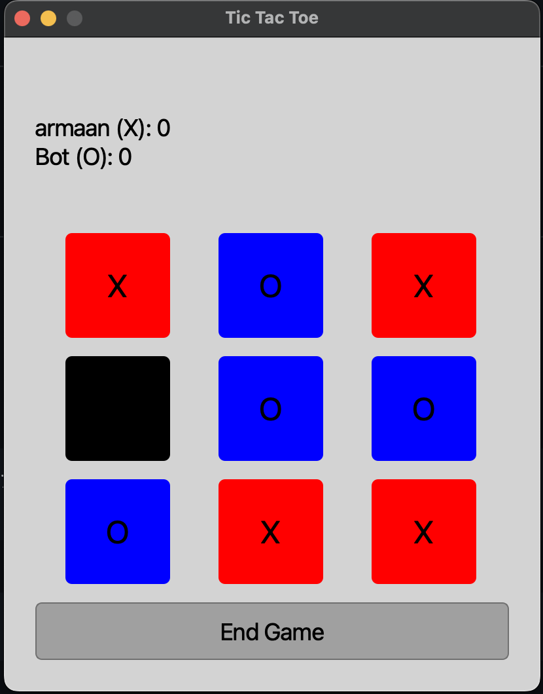
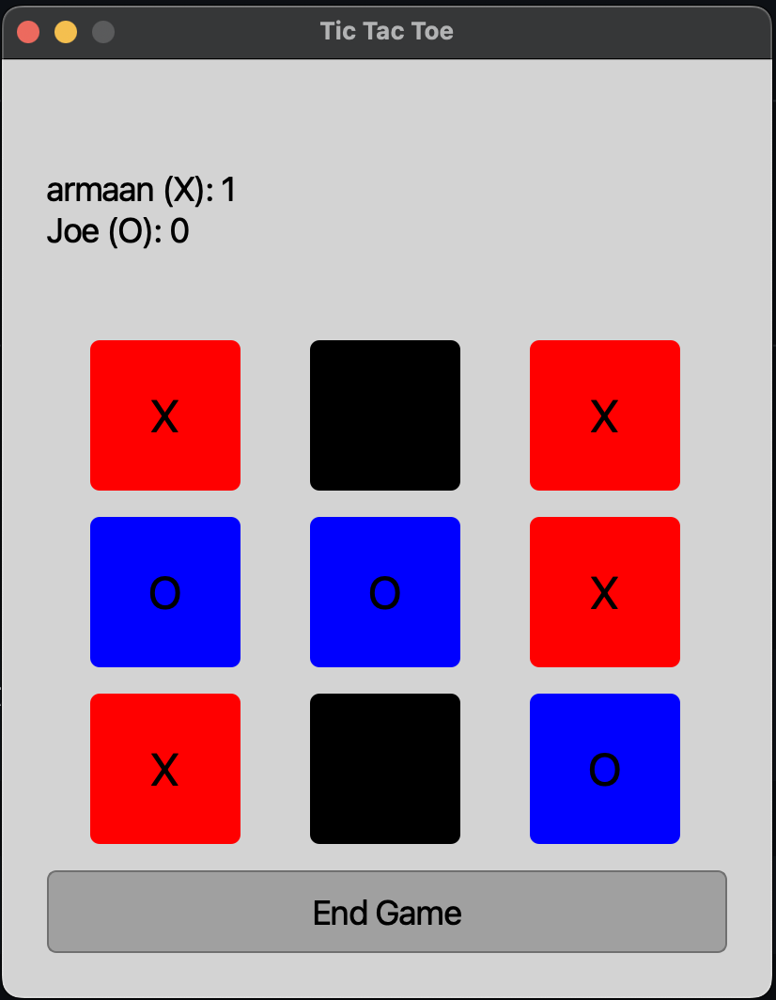
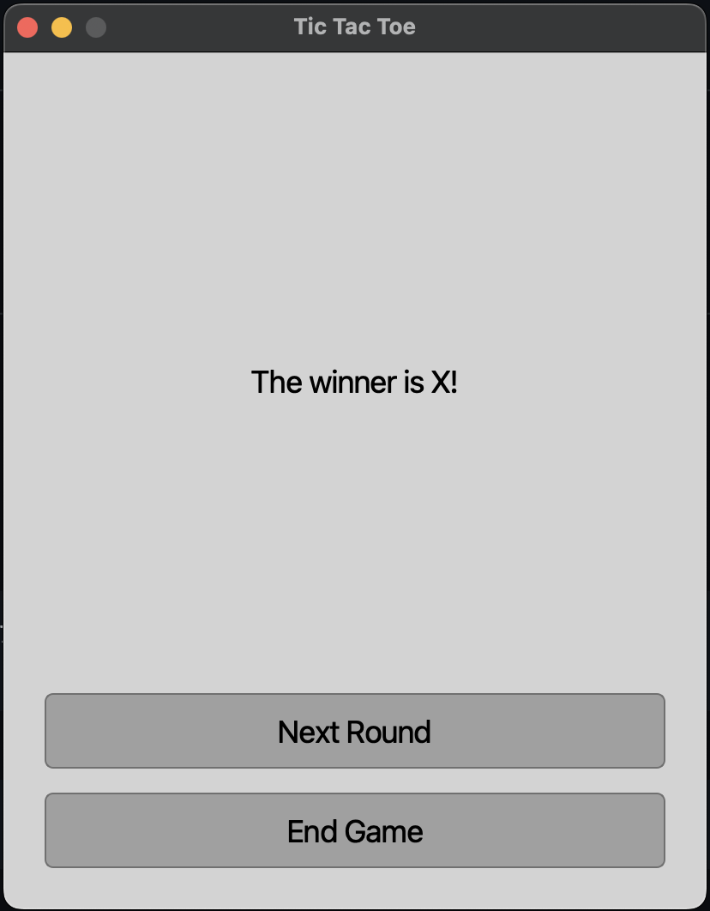
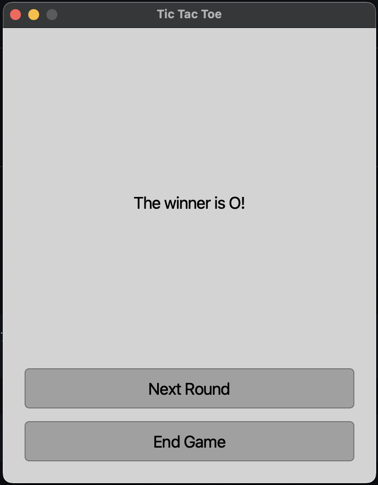
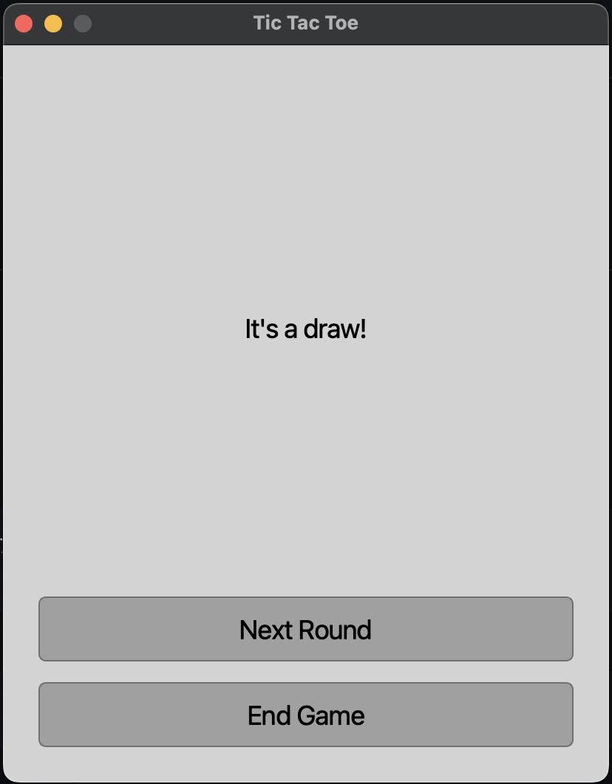
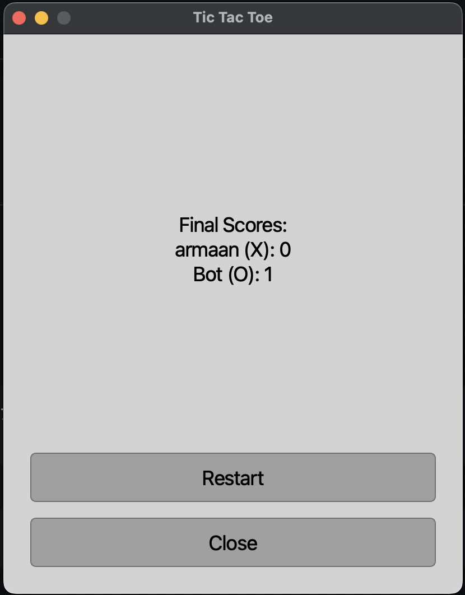
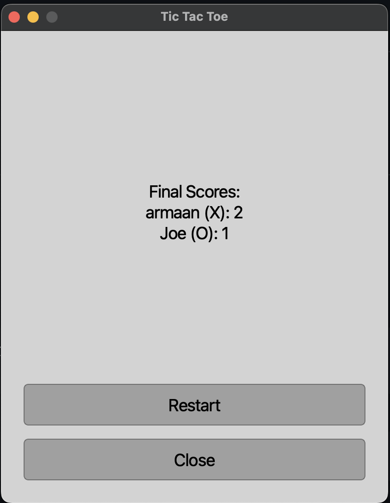

# Tic Tac Toe Game

This is a simple Tic Tac Toe game built using PyQt6. The game supports both single-player (player vs bot) and two-player (player vs player) modes. The application is divided into three main parts: pregame, game, and postgame, each managed in separate files for better organization.

## Features

- Single-player mode (player vs bot)
- Two-player mode (player vs player)
- Score tracking for both players
- User-friendly interface with PyQt6
- Dynamic screens for start, game, and results

## Screenshots











## Requirements

- Python 3.12+
- PyQt6

## Installation

### Clone the Repository

#### Linux and macOS

1. Open a terminal.
2. Clone the repository:
    ```sh
    git clone https://github.com/Armaan4477/TicTacToe_in_Python.git
    cd TicTacToe_in_Python
    ```
3. Install the required packages:
    ```sh
    pip install PyQt6
    ```

#### Windows

1. Open Command Prompt or PowerShell.
2. Clone the repository:
    ```sh
    git clone https://github.com/Armaan4477/TicTacToe_in_Python.git
    cd TicTacToe_in_Python
    ```
3. Install the required packages:
    ```sh
    pip install PyQt6
    ```

### Download the ZIP

#### Linux and macOS

1. Download the ZIP file from the repository and extract it.
2. Open a terminal and navigate to the extracted folder:
    ```sh
    cd TicTacToe_in_Python
    ```
3. Install the required packages:
    ```sh
    pip install PyQt6
    ```

#### Windows

1. Download the ZIP file from the repository and extract it.
2. Open Command Prompt or PowerShell and navigate to the extracted folder:
    ```sh
    cd TicTacToe_in_Python
    ```
3. Install the required packages:
    ```sh
    pip install PyQt6
    ```

## Usage

1. Navigate to the project directory:
    ```sh
    cd TicTacToe_in_Python
    ```

2. Run the application:
    ```sh
    python main.py
    ```

## Running from Visual Studio Code

1. Open Visual Studio Code.
2. Open the project folder (`TicTacToe_in_Python`) in Visual Studio Code.
3. Ensure you have the Python extension installed in Visual Studio Code. You can install it from the Extensions view (`Ctrl+Shift+X`), by searching for "Python" and installing the extension provided by Microsoft.
4. Open the `main.py` file.
5. Click on the Run and Debug icon on the left sidebar or press `Ctrl+Shift+D`.
6. Click on the "Run and Debug" button or press `F5`.
7. Select "Python File" from the options if prompted.

Visual Studio Code will start the application, and you will see the game window.

## Project Structure

```plaintext
TicTacToe_in_Python/
├── [pregame.py]
├── [game.py]
├── [postgame.py]
├── [main.py]
├── [README.md]
└── screenshots/
    ├── start_screen.png
    ├── game_screen.png
    └── results_screen.png